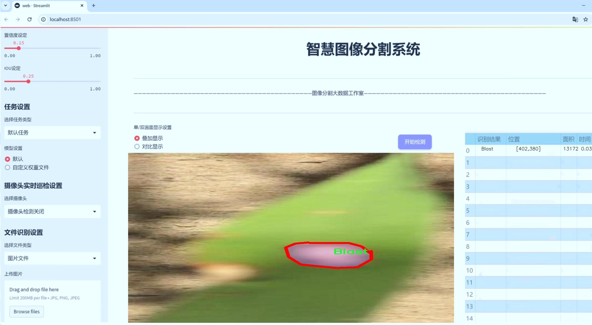

# 水稻病害图像分割系统源码＆数据集分享
 [yolov8-seg-C2f-DiverseBranchBlock＆yolov8-seg-KernelWarehouse等50+全套改进创新点发刊_一键训练教程_Web前端展示]

### 1.研究背景与意义

项目参考[ILSVRC ImageNet Large Scale Visual Recognition Challenge](https://gitee.com/YOLOv8_YOLOv11_Segmentation_Studio/projects)

项目来源[AAAI Global Al lnnovation Contest](https://kdocs.cn/l/cszuIiCKVNis)

研究背景与意义

水稻是全球范围内最重要的粮食作物之一，尤其在亚洲地区，水稻的种植和生产直接关系到数亿人的生计与食品安全。然而，水稻在生长过程中常常受到多种病害的侵袭，这些病害不仅影响水稻的产量，还严重威胁到粮食的质量与安全。根据统计，水稻病害每年造成的损失高达数十亿美元，因此，及时、准确地识别和诊断水稻病害显得尤为重要。传统的病害识别方法主要依赖于人工观察和经验判断，这不仅效率低下，而且容易受到主观因素的影响，导致误判或漏判。因此，开发一种高效、准确的水稻病害图像分割系统具有重要的理论和实际意义。

近年来，随着深度学习技术的快速发展，计算机视觉领域取得了显著的进展，尤其是在图像分割和目标检测方面。YOLO（You Only Look Once）系列模型因其高效的实时检测能力而广泛应用于各类图像处理任务。YOLOv8作为该系列的最新版本，具备更强的特征提取能力和更高的检测精度，为水稻病害的自动识别提供了新的可能性。然而，现有的YOLOv8模型在特定领域的应用仍存在一定的局限性，尤其是在处理复杂背景和多种类病害的图像时，模型的分割精度和鲁棒性有待提高。因此，基于改进YOLOv8的水稻病害图像分割系统的研究具有重要的现实意义。

本研究将利用一个包含6200张图像的水稻病害数据集，涵盖了六种不同的类别，包括“稻瘟病”、“褐斑病”、“健康稻株”、“叶枯病”、“水稻病毒病”和“鞘腐病”。这一数据集的多样性和丰富性为模型的训练和测试提供了良好的基础，使得研究能够更全面地覆盖水稻病害的不同表现形式。通过对YOLOv8模型的改进，我们将探索如何在图像分割任务中提高模型对不同病害的识别能力，尤其是在复杂背景下的表现。这不仅有助于提高水稻病害的自动识别率，还能够为农民提供及时的病害预警，从而减少损失，提高水稻的产量和质量。

此外，本研究还将为水稻病害的智能化管理提供技术支持，推动农业生产的数字化转型。通过将深度学习与农业生产相结合，我们希望能够为农业领域的科研人员和从业者提供一个高效、准确的工具，帮助他们更好地应对水稻病害的挑战，进而促进可持续农业的发展。总之，基于改进YOLOv8的水稻病害图像分割系统的研究不仅具有重要的学术价值，也将为实际农业生产提供切实的帮助，推动粮食安全和农业现代化的进程。

### 2.图片演示




##### 注意：由于此博客编辑较早，上面“2.图片演示”和“3.视频演示”展示的系统图片或者视频可能为老版本，新版本在老版本的基础上升级如下：（实际效果以升级的新版本为准）

  （1）适配了YOLOV8的“目标检测”模型和“实例分割”模型，通过加载相应的权重（.pt）文件即可自适应加载模型。

  （2）支持“图片识别”、“视频识别”、“摄像头实时识别”三种识别模式。

  （3）支持“图片识别”、“视频识别”、“摄像头实时识别”三种识别结果保存导出，解决手动导出（容易卡顿出现爆内存）存在的问题，识别完自动保存结果并导出到tempDir中。

  （4）支持Web前端系统中的标题、背景图等自定义修改，后面提供修改教程。

  另外本项目提供训练的数据集和训练教程,暂不提供权重文件（best.pt）,需要您按照教程进行训练后实现图片演示和Web前端界面演示的效果。

### 3.视频演示

[3.1 视频演示](https://www.bilibili.com/video/BV1YByGYrE9k/)

### 4.数据集信息展示

##### 4.1 本项目数据集详细数据（类别数＆类别名）

nc: 6
names: ['Blast', 'BrownSpot', 'Healthy', 'Leaf Scald', 'Rice-Tungro', 'Sheath Blight']


##### 4.2 本项目数据集信息介绍

数据集信息展示

在现代农业中，水稻作为全球主要的粮食作物之一，其健康状况直接影响到粮食安全和农民的生计。为了有效地监测和管理水稻病害，开发出高效的图像分割系统显得尤为重要。本研究采用的数据集名为“Rice Diseases”，该数据集专门用于训练改进的YOLOv8-seg模型，以实现对水稻病害的精准识别和分割。

“Rice Diseases”数据集包含六个主要类别，分别是“Blast”（稻瘟病）、“Brown Spot”（褐斑病）、“Healthy”（健康）、“Leaf Scald”（叶枯病）、“Rice-Tungro”（稻瘟病）和“Sheath Blight”（ sheath blight）。这些类别涵盖了水稻生长过程中常见的病害，能够为研究人员提供丰富的样本，以便于模型学习和识别不同病害的特征。

在数据集的构建过程中，研究团队通过收集和整理来自不同地区的水稻病害图像，确保数据的多样性和代表性。这些图像不仅包括不同生长阶段的水稻，还涵盖了不同气候条件下的病害表现，使得模型在训练过程中能够学习到更为广泛的特征。此外，数据集中的图像经过精心标注，确保每一张图像中的病害区域都被准确地划分和标识，从而为模型提供高质量的训练数据。

在训练过程中，改进的YOLOv8-seg模型将利用“Rice Diseases”数据集中的图像进行深度学习，提取出各类病害的特征信息。通过对比不同类别的特征，模型能够有效地区分健康水稻与受病害影响的水稻，从而实现高效的图像分割。这一过程不仅提高了模型的识别精度，也为后续的病害管理提供了重要的技术支持。

数据集的设计考虑到了实际应用中的需求，确保模型能够在真实环境中进行有效的病害检测和识别。通过对“Rice Diseases”数据集的深入分析，研究人员能够识别出不同病害的特征，从而为农民提供科学的病害防治建议。此外，该数据集的构建也为后续的研究提供了基础，促进了水稻病害检测技术的不断进步。

总之，“Rice Diseases”数据集不仅为改进YOLOv8-seg模型的训练提供了坚实的基础，也为水稻病害的研究和管理开辟了新的方向。通过对该数据集的深入挖掘和应用，研究人员希望能够提升水稻病害检测的准确性和效率，为保障全球粮食安全贡献一份力量。


### 5.全套项目环境部署视频教程（零基础手把手教学）

[5.1 环境部署教程链接（零基础手把手教学）](https://www.bilibili.com/video/BV1jG4Ve4E9t/?vd_source=bc9aec86d164b67a7004b996143742dc)


[5.2 安装Python虚拟环境创建和依赖库安装视频教程链接（零基础手把手教学）](https://www.bilibili.com/video/BV1nA4VeYEze/?vd_source=bc9aec86d164b67a7004b996143742dc)

### 6.手把手YOLOV8-seg训练视频教程（零基础小白有手就能学会）

[6.1 手把手YOLOV8-seg训练视频教程（零基础小白有手就能学会）](https://www.bilibili.com/video/BV1cA4VeYETe/?vd_source=bc9aec86d164b67a7004b996143742dc)


按照上面的训练视频教程链接加载项目提供的数据集，运行train.py即可开始训练



     Epoch   gpu_mem       box       obj       cls    labels  img_size
     1/200     0G   0.01576   0.01955  0.007536        22      1280: 100%|██████████| 849/849 [14:42<00:00,  1.04s/it]
               Class     Images     Labels          P          R     mAP@.5 mAP@.5:.95: 100%|██████████| 213/213 [01:14<00:00,  2.87it/s]
                 all       3395      17314      0.994      0.957      0.0957      0.0843

     Epoch   gpu_mem       box       obj       cls    labels  img_size
     2/200     0G   0.01578   0.01923  0.007006        22      1280: 100%|██████████| 849/849 [14:44<00:00,  1.04s/it]
               Class     Images     Labels          P          R     mAP@.5 mAP@.5:.95: 100%|██████████| 213/213 [01:12<00:00,  2.95it/s]
                 all       3395      17314      0.996      0.956      0.0957      0.0845

     Epoch   gpu_mem       box       obj       cls    labels  img_size
     3/200     0G   0.01561    0.0191  0.006895        27      1280: 100%|██████████| 849/849 [10:56<00:00,  1.29it/s]
               Class     Images     Labels          P          R     mAP@.5 mAP@.5:.95: 100%|███████   | 187/213 [00:52<00:00,  4.04it/s]
                 all       3395      17314      0.996      0.957      0.0957      0.0845


### 7.50+种全套YOLOV8-seg创新点代码加载调参视频教程（一键加载写好的改进模型的配置文件）

[7.1 50+种全套YOLOV8-seg创新点代码加载调参视频教程（一键加载写好的改进模型的配置文件）](https://www.bilibili.com/video/BV1Hw4VePEXv/?vd_source=bc9aec86d164b67a7004b996143742dc)

### 8.YOLOV8-seg图像分割算法原理

原始YOLOv8-seg算法原理

YOLOv8-seg算法是由Ultralytics公司在2023年1月10日推出的YOLO系列中的最新版本，标志着目标检测和实例分割领域的一次重要进步。该算法在YOLOv7的基础上进行了深度优化，旨在提升目标检测的精度和速度。YOLOv8-seg不仅继承了YOLO系列的优良传统，还引入了一系列创新的技术和结构，使其在各类应用场景中表现出色。

首先，YOLOv8-seg采用了更深的卷积神经网络结构，这一设计使得模型能够更好地捕捉图像中的复杂特征。与传统的滑动窗口或区域提议方法不同，YOLOv8-seg将整个图像作为输入，直接在图像上进行目标检测和定位。这种端到端的处理方式大大提高了检测的速度和精度，使得YOLOv8-seg在实时应用中具有明显的优势。

在网络结构方面，YOLOv8-seg依然遵循了YOLOv5的设计思路，采用了输入层、主干网络、特征融合层和解耦头的组合。其主干网络使用了CSPDarknet结构，并将YOLOv5中的C3模块替换为C2f模块。这一变化不仅实现了模型的轻量化，同时也确保了检测精度的提升。C2f模块的设计灵感来源于YOLOv7的ELAN思想，通过增加跳层连接和分支结构，增强了特征的重用性和梯度流动，进而提高了模型的收敛速度和性能。

特征融合层采用了PAN-FPN结构，能够有效地将不同尺度的特征进行融合。这一结构的设计考虑到了多尺度信息的整合，使得YOLOv8-seg能够在不同分辨率下进行准确的目标检测。通过对浅层特征、中层特征和高层特征的深度融合，YOLOv8-seg能够充分利用图像中的细节信息和语义信息，从而提升检测的准确性。

YOLOv8-seg在检测头的设计上也进行了重要的创新，采用了Anchor-Free的检测方式，抛弃了传统的Anchor-Based方法。这一变化使得模型在处理小目标和高分辨率图像时表现更加优异。此外，YOLOv8-seg的损失函数也进行了改进，使用了VFLLoss和DFLLoss+CIoULoss的组合，进一步提升了分类和回归的性能。这种新的损失函数设计考虑到了样本不平衡的问题，能够有效地提高模型在困难样本上的学习能力。

在数据预处理方面，YOLOv8-seg采用了YOLOv5的策略，包括马赛克增强、混合增强、空间扰动和颜色扰动等多种增强手段。这些数据增强技术的引入，进一步丰富了训练数据的多样性，使得模型在面对不同场景和条件时具有更强的适应能力。

YOLOv8-seg的整体架构设计旨在实现高效的目标检测和实例分割。通过引入新的特征提取模块和特征融合策略，YOLOv8-seg能够在保证高精度的同时，显著提高检测速度。这一特性使得YOLOv8-seg在智能监控、自动驾驶、医疗影像分析等多个领域具有广泛的应用前景。

综上所述，YOLOv8-seg算法在YOLO系列的基础上，通过多项技术创新和结构优化，成功实现了目标检测和实例分割的高效融合。其深度卷积神经网络结构、Anchor-Free检测方式以及先进的损失函数设计，使得YOLOv8-seg在各种复杂场景中都能展现出卓越的性能。随着YOLOv8-seg的推广和应用，目标检测和实例分割的技术水平将进一步提升，为相关领域的发展带来新的机遇。


### 9.系统功能展示（检测对象为举例，实际内容以本项目数据集为准）

图9.1.系统支持检测结果表格显示

  图9.2.系统支持置信度和IOU阈值手动调节

  图9.3.系统支持自定义加载权重文件best.pt(需要你通过步骤5中训练获得)

  图9.4.系统支持摄像头实时识别

  图9.5.系统支持图片识别

  图9.6.系统支持视频识别

  图9.7.系统支持识别结果文件自动保存

  图9.8.系统支持Excel导出检测结果数据


### 10.50+种全套YOLOV8-seg创新点原理讲解（非科班也可以轻松写刊发刊，V11版本正在科研待更新）

#### 10.1 由于篇幅限制，每个创新点的具体原理讲解就不一一展开，具体见下列网址中的创新点对应子项目的技术原理博客网址【Blog】：


[10.1 50+种全套YOLOV8-seg创新点原理讲解链接](https://gitee.com/qunmasj/good)

#### 10.2 部分改进模块原理讲解(完整的改进原理见上图和技术博客链接)【如果此小节的图加载失败可以通过CSDN或者Github搜索该博客的标题访问原始博客，原始博客图片显示正常】
### YOLOv8简介
#### Yolov8网络模型
Yolov8n的网络分为输入端、主干网( Back-bone) 、Neck模块和输出端4个部分（图4)。输
人端主要有马赛克( Mosaic）数据增强、自适应锚框计算和自适应灰度填充。主干网有Conv、C2和SPPF结构，其中，C2r模块是对残差特征进行学习的主要模块，该模块仿照Yolov7的ELAN结构,通过更多的分支跨层连接，丰富了模型的梯度流，可形成一个具有更强特征表示能力的神经网络模
块。Neck模块采用PAN ( path aggregation nelwOrk ,结构，可加强网络对不同缩放尺度对象特征融合的
能力。输出端将分类和检测过程进行解耦，主要包括损失计算和目标检测框筛选，其中，损失计算过程主要包括正负样本分配策略和 Loss计算，Yolov8n 网络主要使用TaskAlignedAssignerl 10]方法，即根据分类与回归的分数加权结果选择正样本;Loss计算包括分类和回归2个分支，无Ob-jecIness分支。分类分支依然采用BCE Loss，回归分支则使用了Distribution Focal Loss!11〕和CIOU( complele inlersection over union)损失函数。

### 可扩张残差（DWR）注意力模块
当前的许多工作直接采用多速率深度扩张卷积从一个输入特征图中同时捕获多尺度上下文信息，从而提高实时语义分割的特征提取效率。 然而，这种设计可能会因为结构和超参数的不合理而导致多尺度上下文信息的访问困难。 为了降低绘制多尺度上下文信息的难度，我们提出了一种高效的多尺度特征提取方法，该方法分解了原始的单步特征提取方法方法分为两个步骤，区域残差-语义残差。 在该方法中，多速率深度扩张卷积在特征提取中发挥更简单的作用：根据第一步提供的每个简明区域形式特征图，在第二步中使用一个所需的感受野执行简单的基于语义的形态过滤 一步，提高他们的效率。 此外，扩张率和扩张卷积的容量每个网络阶段都经过精心设计，以充分利用所有可以实现的区域形式的特征图。 因此，我们分别为高层和低层网络设计了一种新颖的扩张式残差（DWR）模块和简单倒置残差（SIR）模块。


首先，该博客引入了一个Dilation-wise Residual（DWR）模块，用于提取网络高层的特征，如图2a所示。多分支结构用于扩展感受野，其中每个分支采用不同空洞率的空洞深度卷积。
然后，专门设计了一个Simple Inverted Residual（SIR）模块来提取网络低层的特征，如图2b所示。该模块仅具有3×3的微小感受野，但使用inverted bottleneck式结构来扩展通道数量，确保更强的特征提取能力。
最后，基于DWR和SIR模块，构建了一个编码器-解码器风格的网络DWRSeg，其中解码器采用了简单的类似FCN的结构。解码器使用来自最后两个阶段的强语义信息直接对特征图进行上采样，然后将它们与来自较低阶段的特征图（包含丰富的详细信息）拼接起来，以进行最终预测。


### 11.项目核心源码讲解（再也不用担心看不懂代码逻辑）

#### 11.1 ultralytics\engine\validator.py

以下是经过简化和注释的代码，保留了最核心的部分，主要集中在模型验证的逻辑上：

```python
import json
import time
from pathlib import Path
import numpy as np
import torch
from ultralytics.cfg import get_cfg, get_save_dir
from ultralytics.nn.autobackend import AutoBackend
from ultralytics.utils import LOGGER, TQDM, callbacks
from ultralytics.utils.checks import check_imgsz
from ultralytics.utils.ops import Profile
from ultralytics.utils.torch_utils import select_device, smart_inference_mode

class BaseValidator:
    """
    BaseValidator 类用于模型验证的基类。
    """

    def __init__(self, dataloader=None, save_dir=None, args=None, _callbacks=None):
        """
        初始化 BaseValidator 实例。

        Args:
            dataloader (torch.utils.data.DataLoader): 用于验证的数据加载器。
            save_dir (Path, optional): 结果保存目录。
            args (SimpleNamespace): 验证器的配置。
            _callbacks (dict): 存储各种回调函数的字典。
        """
        self.args = get_cfg(overrides=args)  # 获取配置
        self.dataloader = dataloader
        self.save_dir = save_dir or get_save_dir(self.args)  # 设置保存目录
        self.model = None
        self.device = None
        self.batch_i = None
        self.speed = {'preprocess': 0.0, 'inference': 0.0, 'loss': 0.0, 'postprocess': 0.0}
        self.callbacks = _callbacks or callbacks.get_default_callbacks()  # 获取回调函数

    @smart_inference_mode()
    def __call__(self, trainer=None, model=None):
        """
        支持验证预训练模型或正在训练的模型。
        """
        self.device = select_device(self.args.device)  # 选择设备
        model = AutoBackend(model or self.args.model, device=self.device)  # 加载模型
        model.eval()  # 设置模型为评估模式

        # 运行验证过程
        bar = TQDM(self.dataloader, desc='Validating', total=len(self.dataloader))
        for batch_i, batch in enumerate(bar):
            # 预处理
            batch = self.preprocess(batch)

            # 推理
            preds = model(batch['img'])

            # 更新指标
            self.update_metrics(preds, batch)

        # 打印结果
        self.print_results()

    def preprocess(self, batch):
        """预处理输入批次。"""
        return batch  # 这里可以添加实际的预处理逻辑

    def update_metrics(self, preds, batch):
        """根据预测和批次更新指标。"""
        pass  # 这里可以添加实际的指标更新逻辑

    def print_results(self):
        """打印模型预测的结果。"""
        pass  # 这里可以添加实际的结果打印逻辑
```

### 代码说明
1. **BaseValidator 类**: 这是一个用于模型验证的基类，提供了初始化和调用的基本框架。
2. **初始化方法 `__init__`**: 
   - 读取配置并设置数据加载器和保存目录。
   - 初始化一些必要的属性，例如模型、设备、批次索引和速度字典。
3. **调用方法 `__call__`**: 
   - 选择设备并加载模型。
   - 进入验证循环，逐批处理数据，进行预处理、推理和指标更新。
4. **预处理方法 `preprocess`**: 目前仅返回输入批次，可以在此添加实际的预处理逻辑。
5. **更新指标方法 `update_metrics`**: 目前为空，可以在此添加实际的指标更新逻辑。
6. **打印结果方法 `print_results`**: 目前为空，可以在此添加实际的结果打印逻辑。

这个简化版本的代码保留了模型验证的核心逻辑，并添加了中文注释以便于理解。

这个文件是Ultralytics YOLO（You Only Look Once）项目中的一个重要组件，主要用于验证模型在测试集或验证集上的准确性。它定义了一个基类`BaseValidator`，用于创建验证器，提供了一系列方法和属性来处理模型验证的过程。

在文件开头，提供了使用该验证器的基本命令行示例，说明如何通过命令行接口调用验证功能。用户可以指定模型文件、数据集配置文件和图像大小等参数，支持多种模型格式，包括PyTorch、ONNX、TensorFlow等。

`BaseValidator`类的构造函数初始化了一些重要的属性，包括配置参数、数据加载器、模型、设备、当前批次索引、类名、统计信息等。它还会根据传入的参数设置默认值，比如置信度阈值和图像大小，并创建保存结果的目录。

该类的核心功能通过`__call__`方法实现，支持对预训练模型或正在训练的模型进行验证。方法中首先判断模型是否在训练中，并根据情况设置设备和数据集。然后，初始化进度条和性能指标，开始循环处理每个批次的数据。在每个批次中，执行预处理、推理、损失计算和后处理，并更新性能指标。

`match_predictions`方法用于将预测结果与真实标签进行匹配，基于IoU（Intersection over Union）值来判断预测是否正确。该方法可以选择使用SciPy库进行更精确的匹配。

此外，`BaseValidator`类还提供了一些回调机制，允许用户在验证过程中的特定事件（如验证开始、批次开始、批次结束等）插入自定义的回调函数。这使得验证过程更加灵活，可以根据需要进行扩展。

类中还定义了一些抽象方法，如`get_dataloader`和`build_dataset`，这些方法需要在子类中实现，以便具体化数据加载和数据集构建的逻辑。

最后，类中还包含了一些用于处理性能指标和结果输出的方法，如`init_metrics`、`update_metrics`、`finalize_metrics`等，这些方法负责初始化、更新和最终化模型的性能指标，并打印结果。

总的来说，这个文件提供了一个结构化的框架，用于验证YOLO模型的性能，支持多种数据集和模型格式，具有良好的扩展性和灵活性。

#### 11.2 ultralytics\nn\extra_modules\dynamic_snake_conv.py

以下是经过简化并注释的核心代码部分：

```python
import torch
import torch.nn as nn

class DySnakeConv(nn.Module):
    def __init__(self, inc, ouc, k=3) -> None:
        super().__init__()
        # 初始化三个卷积层
        self.conv_0 = Conv(inc, ouc, k)  # 标准卷积
        self.conv_x = DSConv(inc, ouc, 0, k)  # 沿x轴的动态蛇形卷积
        self.conv_y = DSConv(inc, ouc, 1, k)  # 沿y轴的动态蛇形卷积
    
    def forward(self, x):
        # 前向传播，拼接三个卷积的输出
        return torch.cat([self.conv_0(x), self.conv_x(x), self.conv_y(x)], dim=1)

class DSConv(nn.Module):
    def __init__(self, in_ch, out_ch, morph, kernel_size=3, if_offset=True, extend_scope=1):
        super(DSConv, self).__init__()
        # 用于学习可变形偏移的卷积层
        self.offset_conv = nn.Conv2d(in_ch, 2 * kernel_size, 3, padding=1)
        self.bn = nn.BatchNorm2d(2 * kernel_size)  # 批归一化
        self.kernel_size = kernel_size

        # 定义沿x轴和y轴的动态蛇形卷积
        self.dsc_conv_x = nn.Conv2d(in_ch, out_ch, kernel_size=(kernel_size, 1), stride=(kernel_size, 1), padding=0)
        self.dsc_conv_y = nn.Conv2d(in_ch, out_ch, kernel_size=(1, kernel_size), stride=(1, kernel_size), padding=0)

        self.gn = nn.GroupNorm(out_ch // 4, out_ch)  # 组归一化
        self.act = Conv.default_act  # 默认激活函数

        self.extend_scope = extend_scope
        self.morph = morph
        self.if_offset = if_offset

    def forward(self, f):
        # 计算偏移量
        offset = self.offset_conv(f)
        offset = self.bn(offset)
        offset = torch.tanh(offset)  # 将偏移量限制在[-1, 1]之间

        # 进行可变形卷积
        dsc = DSC(f.shape, self.kernel_size, self.extend_scope, self.morph)
        deformed_feature = dsc.deform_conv(f, offset, self.if_offset)

        # 根据形态选择对应的卷积操作
        if self.morph == 0:
            x = self.dsc_conv_x(deformed_feature.type(f.dtype))
        else:
            x = self.dsc_conv_y(deformed_feature.type(f.dtype))

        x = self.gn(x)  # 归一化
        x = self.act(x)  # 激活
        return x

class DSC(object):
    def __init__(self, input_shape, kernel_size, extend_scope, morph):
        self.num_points = kernel_size
        self.width = input_shape[2]
        self.height = input_shape[3]
        self.morph = morph
        self.extend_scope = extend_scope  # 偏移范围

        # 定义特征图的形状
        self.num_batch = input_shape[0]
        self.num_channels = input_shape[1]

    def _coordinate_map_3D(self, offset, if_offset):
        # 计算坐标映射
        device = offset.device
        y_offset, x_offset = torch.split(offset, self.num_points, dim=1)

        # 生成中心坐标
        y_center = torch.arange(0, self.width).repeat([self.height]).reshape(self.height, self.width).permute(1, 0).reshape([-1, self.width, self.height]).repeat([self.num_points, 1, 1]).float().unsqueeze(0)
        x_center = torch.arange(0, self.height).repeat([self.width]).reshape(self.width, self.height).permute(0, 1).reshape([-1, self.width, self.height]).repeat([self.num_points, 1, 1]).float().unsqueeze(0)

        # 根据形态初始化卷积核
        if self.morph == 0:
            y = torch.linspace(0, 0, 1)
            x = torch.linspace(-int(self.num_points // 2), int(self.num_points // 2), int(self.num_points))
        else:
            y = torch.linspace(-int(self.num_points // 2), int(self.num_points // 2), int(self.num_points))
            x = torch.linspace(0, 0, 1)

        # 生成新的坐标
        y_new = y_center + y.reshape(-1, 1).repeat([1, self.width * self.height]).reshape([self.num_points, self.width, self.height]).unsqueeze(0)
        x_new = x_center + x.reshape(-1, 1).repeat([1, self.width * self.height]).reshape([self.num_points, self.width, self.height]).unsqueeze(0)

        # 应用偏移
        if if_offset:
            # 偏移的处理逻辑
            pass  # 具体的偏移处理逻辑省略

        return y_new, x_new

    def deform_conv(self, input, offset, if_offset):
        # 执行可变形卷积
        y, x = self._coordinate_map_3D(offset, if_offset)
        deformed_feature = self._bilinear_interpolate_3D(input, y, x)
        return deformed_feature

    def _bilinear_interpolate_3D(self, input_feature, y, x):
        # 进行双线性插值
        pass  # 具体的插值逻辑省略
```

### 注释说明：
1. **DySnakeConv** 类是动态蛇形卷积的主要实现，包含三个卷积层，分别是标准卷积和两个动态蛇形卷积。
2. **DSConv** 类实现了动态蛇形卷积的核心逻辑，包括偏移量的计算和特征图的变形。
3. **DSC** 类负责生成坐标映射和执行可变形卷积，使用了双线性插值方法来处理特征图的变形。
4. 省略的部分主要是为了简化代码并集中于核心逻辑，具体的偏移处理和插值逻辑可以根据需要进一步实现。

这个程序文件定义了一个动态蛇形卷积（Dynamic Snake Convolution）模块，主要用于深度学习中的卷积操作。文件中包含两个主要的类：`DySnakeConv` 和 `DSConv`，以及一个辅助类 `DSC`。

首先，`DySnakeConv` 类是一个神经网络模块，继承自 `nn.Module`。在其构造函数中，初始化了三个卷积层：`conv_0`、`conv_x` 和 `conv_y`。其中，`conv_0` 是一个标准卷积层，而 `conv_x` 和 `conv_y` 是动态蛇形卷积层，分别沿着 x 轴和 y 轴进行操作。`forward` 方法接受输入张量 `x`，并将三个卷积层的输出在通道维度上进行拼接，返回拼接后的结果。

接下来，`DSConv` 类实现了动态蛇形卷积的具体操作。构造函数中定义了输入和输出通道数、卷积核大小、形态参数、是否使用偏移量等参数。该类中包含了一个用于学习偏移量的卷积层 `offset_conv`，以及两个卷积层 `dsc_conv_x` 和 `dsc_conv_y`，分别用于处理 x 轴和 y 轴的动态卷积。`forward` 方法中，首先通过 `offset_conv` 计算偏移量，然后使用 `DSC` 类生成的坐标图进行变形卷积，最后根据形态参数选择相应的卷积层进行处理。

`DSC` 类则是实现动态卷积的核心部分。它的构造函数接收输入形状、卷积核大小、扩展范围和形态参数。该类中定义了 `_coordinate_map_3D` 方法，用于生成偏移后的坐标图，和 `_bilinear_interpolate_3D` 方法，用于进行双线性插值，从而实现对输入特征图的变形卷积。`deform_conv` 方法结合了这两个步骤，完成了最终的变形卷积操作。

整体来看，这个文件实现了一个灵活且具有动态特性的卷积模块，能够根据输入特征图的内容进行自适应的卷积操作，从而提高了模型的表达能力和性能。

#### 11.3 ui.py

以下是保留的核心代码部分，并添加了详细的中文注释：

```python
import sys
import subprocess

def run_script(script_path):
    """
    使用当前 Python 环境运行指定的脚本。

    Args:
        script_path (str): 要运行的脚本路径

    Returns:
        None
    """
    # 获取当前 Python 解释器的路径
    python_path = sys.executable

    # 构建运行命令，使用 streamlit 运行指定的脚本
    command = f'"{python_path}" -m streamlit run "{script_path}"'

    # 执行命令，并等待其完成
    result = subprocess.run(command, shell=True)
    
    # 检查命令执行的返回码，如果不为0则表示出错
    if result.returncode != 0:
        print("脚本运行出错。")

# 实例化并运行应用
if __name__ == "__main__":
    # 指定要运行的脚本路径
    script_path = "web.py"  # 这里可以替换为实际的脚本路径

    # 调用函数运行脚本
    run_script(script_path)
```

### 代码说明：
1. **导入模块**：
   - `sys`：用于获取当前 Python 解释器的路径。
   - `subprocess`：用于执行外部命令。

2. **定义 `run_script` 函数**：
   - 接受一个参数 `script_path`，表示要运行的 Python 脚本的路径。
   - 使用 `sys.executable` 获取当前 Python 解释器的路径。
   - 构建命令字符串，使用 `streamlit` 运行指定的脚本。
   - 使用 `subprocess.run` 执行命令，并等待其完成。
   - 检查命令的返回码，如果返回码不为0，表示脚本运行出错，打印错误信息。

3. **主程序入口**：
   - 在 `__main__` 块中，指定要运行的脚本路径（这里是 `web.py`）。
   - 调用 `run_script` 函数来执行指定的脚本。

这个程序文件的主要功能是通过当前的 Python 环境来运行一个指定的脚本，具体是一个名为 `web.py` 的文件。程序首先导入了必要的模块，包括 `sys`、`os` 和 `subprocess`，以及一个自定义的 `abs_path` 函数，用于获取文件的绝对路径。

在 `run_script` 函数中，首先获取当前 Python 解释器的路径，这样可以确保使用正确的 Python 环境来执行脚本。接着，构建一个命令字符串，这个命令使用 `streamlit` 模块来运行指定的脚本。`streamlit` 是一个用于构建数据应用的库，通常用于快速开发和展示数据可视化应用。

然后，使用 `subprocess.run` 方法来执行这个命令。这个方法会在一个新的 shell 中运行命令，并等待其完成。如果脚本运行过程中出现错误，返回的 `returncode` 将不为零，程序会打印出“脚本运行出错”的提示信息。

在文件的最后部分，使用 `if __name__ == "__main__":` 语句来确保只有在直接运行该文件时才会执行下面的代码。这里指定了要运行的脚本路径为 `web.py`，并调用 `run_script` 函数来执行这个脚本。

总的来说，这个程序的作用是为用户提供一个简单的接口，通过命令行运行一个 Streamlit 应用脚本，方便用户在当前的 Python 环境中进行开发和测试。

#### 11.4 train.py

以下是代码中最核心的部分，并附上详细的中文注释：

```python
import os
import torch
import yaml
from ultralytics import YOLO  # 导入YOLO模型库

if __name__ == '__main__':  # 确保该模块被直接运行时才执行以下代码
    # 设置训练参数
    workers = 1  # 数据加载的工作进程数量
    batch = 8  # 每个批次的样本数量，需根据显存和内存调整
    device = "0" if torch.cuda.is_available() else "cpu"  # 检查是否有可用的GPU

    # 获取数据集配置文件的绝对路径
    data_path = abs_path(f'datasets/data/data.yaml', path_type='current')

    # 将路径格式转换为Unix风格
    unix_style_path = data_path.replace(os.sep, '/')
    # 获取数据集目录路径
    directory_path = os.path.dirname(unix_style_path)

    # 读取YAML配置文件
    with open(data_path, 'r') as file:
        data = yaml.load(file, Loader=yaml.FullLoader)

    # 修改YAML文件中的路径项
    if 'train' in data and 'val' in data and 'test' in data:
        data['train'] = directory_path + '/train'  # 更新训练集路径
        data['val'] = directory_path + '/val'      # 更新验证集路径
        data['test'] = directory_path + '/test'    # 更新测试集路径

        # 将修改后的数据写回YAML文件
        with open(data_path, 'w') as file:
            yaml.safe_dump(data, file, sort_keys=False)

    # 加载YOLO模型配置并预训练权重
    model = YOLO(r"C:\codeseg\codenew\50+种YOLOv8算法改进源码大全和调试加载训练教程（非必要）\改进YOLOv8模型配置文件\yolov8-seg-C2f-Faster.yaml").load("./weights/yolov8s-seg.pt")

    # 开始训练模型
    results = model.train(
        data=data_path,  # 指定训练数据的配置文件路径
        device=device,  # 使用指定的设备进行训练
        workers=workers,  # 使用的工作进程数量
        imgsz=640,  # 输入图像的大小
        epochs=100,  # 训练的轮数
        batch=batch,  # 每个批次的样本数量
    )
```

### 代码注释说明：
1. **导入必要的库**：导入了操作系统相关的库、PyTorch、YAML解析库和YOLO模型库。
2. **主程序入口**：使用`if __name__ == '__main__':`确保代码仅在直接运行时执行。
3. **设置训练参数**：定义了数据加载的工作进程数量、批次大小和设备类型（GPU或CPU）。
4. **获取数据集配置文件路径**：使用`abs_path`函数获取数据集配置文件的绝对路径，并转换为Unix风格路径。
5. **读取和修改YAML文件**：读取YAML文件，更新训练、验证和测试集的路径，并将修改后的内容写回文件。
6. **加载YOLO模型**：加载YOLO模型的配置文件和预训练权重。
7. **训练模型**：调用`model.train`方法开始训练，传入必要的参数，如数据路径、设备、工作进程数量、图像大小、训练轮数和批次大小。

这个程序文件 `train.py` 是用于训练 YOLO（You Only Look Once）模型的脚本，主要涉及数据准备、模型加载和训练过程。首先，程序导入了必要的库，包括 `os`、`torch`、`yaml` 和 `ultralytics` 中的 YOLO 模型。接着，使用 `matplotlib` 设置图形后端为 `TkAgg`，这通常用于可视化，但在这个脚本中并没有具体的可视化代码。

在 `if __name__ == '__main__':` 这一部分，程序首先定义了一些训练参数，如工作进程数 `workers`、批次大小 `batch` 和设备 `device`。设备的选择是通过检查是否有可用的 GPU（使用 `torch.cuda.is_available()`）来决定的，如果有，则使用 GPU（标记为 "0"），否则使用 CPU。

接下来，程序通过 `abs_path` 函数获取数据集配置文件 `data.yaml` 的绝对路径，并将路径中的分隔符统一为 Unix 风格。然后，使用 `os.path.dirname` 获取该路径的目录部分。程序打开 `data.yaml` 文件并读取其内容，使用 `yaml.load` 保持原有顺序。

在读取到数据后，程序检查 YAML 文件中是否包含 `train`、`val` 和 `test` 这三个字段。如果存在，程序将这些字段的值修改为相应的训练、验证和测试数据的目录路径，并将修改后的内容写回到 YAML 文件中，确保后续训练时能够正确找到数据。

接下来，程序加载 YOLO 模型，指定了一个配置文件的路径和预训练权重的路径。这里的模型配置文件可以根据需求进行更换，以适应不同的模型结构和训练要求。

最后，程序调用 `model.train()` 方法开始训练，传入了数据配置文件路径、设备、工作进程数、输入图像大小、训练轮数和批次大小等参数。训练过程将根据这些参数进行模型的训练，直到达到指定的轮数。

整体来看，这个脚本提供了一个完整的训练流程，从数据准备到模型训练，适合用于深度学习任务中的目标检测或图像分割等应用。

#### 11.5 ultralytics\models\yolo\segment\val.py

以下是代码中最核心的部分，并附上详细的中文注释：

```python
class SegmentationValidator(DetectionValidator):
    """
    扩展DetectionValidator类，用于基于分割模型的验证。
    """

    def __init__(self, dataloader=None, save_dir=None, pbar=None, args=None, _callbacks=None):
        """初始化SegmentationValidator，并将任务设置为'segment'，指标设置为SegmentMetrics。"""
        super().__init__(dataloader, save_dir, pbar, args, _callbacks)
        self.plot_masks = None  # 用于存储绘图的掩码
        self.process = None  # 处理掩码的函数
        self.args.task = 'segment'  # 设置任务类型为分割
        self.metrics = SegmentMetrics(save_dir=self.save_dir, on_plot=self.on_plot)  # 初始化指标

    def preprocess(self, batch):
        """预处理批次，将掩码转换为浮点数并发送到设备。"""
        batch = super().preprocess(batch)  # 调用父类的预处理方法
        batch['masks'] = batch['masks'].to(self.device).float()  # 将掩码转移到设备并转换为浮点数
        return batch

    def postprocess(self, preds):
        """后处理YOLO预测，返回输出检测结果和原型。"""
        p = ops.non_max_suppression(preds[0],  # 进行非极大值抑制
                                    self.args.conf,
                                    self.args.iou,
                                    labels=self.lb,
                                    multi_label=True,
                                    agnostic=self.args.single_cls,
                                    max_det=self.args.max_det,
                                    nc=self.nc)
        proto = preds[1][-1] if len(preds[1]) == 3 else preds[1]  # 获取原型
        return p, proto  # 返回处理后的预测结果和原型

    def update_metrics(self, preds, batch):
        """更新指标。"""
        for si, (pred, proto) in enumerate(zip(preds[0], preds[1])):
            idx = batch['batch_idx'] == si  # 获取当前批次的索引
            cls = batch['cls'][idx]  # 获取当前批次的类别
            bbox = batch['bboxes'][idx]  # 获取当前批次的边界框
            nl, npr = cls.shape[0], pred.shape[0]  # 标签和预测的数量
            shape = batch['ori_shape'][si]  # 获取原始形状
            correct_masks = torch.zeros(npr, self.niou, dtype=torch.bool, device=self.device)  # 初始化正确掩码
            correct_bboxes = torch.zeros(npr, self.niou, dtype=torch.bool, device=self.device)  # 初始化正确边界框
            self.seen += 1  # 更新已处理的样本数量

            if npr == 0:  # 如果没有预测
                if nl:  # 如果有标签
                    self.stats.append((correct_bboxes, correct_masks, *torch.zeros((2, 0), device=self.device), cls.squeeze(-1)))
                continue  # 继续处理下一个批次

            # 处理掩码
            midx = [si] if self.args.overlap_mask else idx  # 根据是否重叠掩码选择索引
            gt_masks = batch['masks'][midx]  # 获取真实掩码
            pred_masks = self.process(proto, pred[:, 6:], pred[:, :4], shape=batch['img'][si].shape[1:])  # 处理预测掩码

            # 预测处理
            if self.args.single_cls:
                pred[:, 5] = 0  # 如果是单类，设置类别为0
            predn = pred.clone()  # 克隆预测结果
            ops.scale_boxes(batch['img'][si].shape[1:], predn[:, :4], shape, ratio_pad=batch['ratio_pad'][si])  # 缩放边界框

            # 评估
            if nl:  # 如果有标签
                height, width = batch['img'].shape[2:]  # 获取图像的高度和宽度
                tbox = ops.xywh2xyxy(bbox) * torch.tensor((width, height, width, height), device=self.device)  # 转换标签边界框
                ops.scale_boxes(batch['img'][si].shape[1:], tbox, shape, ratio_pad=batch['ratio_pad'][si])  # 缩放标签边界框
                labelsn = torch.cat((cls, tbox), 1)  # 合并标签和边界框
                correct_bboxes = self._process_batch(predn, labelsn)  # 处理边界框
                correct_masks = self._process_batch(predn, labelsn, pred_masks, gt_masks, overlap=self.args.overlap_mask, masks=True)  # 处理掩码

            # 追加正确的掩码和边界框
            self.stats.append((correct_bboxes, correct_masks, pred[:, 4], pred[:, 5], cls.squeeze(-1)))

    def _process_batch(self, detections, labels, pred_masks=None, gt_masks=None, overlap=False, masks=False):
        """
        返回正确的预测矩阵。

        参数:
            detections (array[N, 6]), x1, y1, x2, y2, conf, class
            labels (array[M, 5]), class, x1, y1, x2, y2

        返回:
            correct (array[N, 10]), 对于10个IoU级别
        """
        if masks:  # 如果处理掩码
            if overlap:  # 如果考虑重叠
                nl = len(labels)
                index = torch.arange(nl, device=gt_masks.device).view(nl, 1, 1) + 1
                gt_masks = gt_masks.repeat(nl, 1, 1)  # 扩展真实掩码
                gt_masks = torch.where(gt_masks == index, 1.0, 0.0)  # 将掩码转换为二值
            if gt_masks.shape[1:] != pred_masks.shape[1:]:  # 如果真实掩码和预测掩码形状不一致
                gt_masks = F.interpolate(gt_masks[None], pred_masks.shape[1:], mode='bilinear', align_corners=False)[0]  # 进行插值
                gt_masks = gt_masks.gt_(0.5)  # 二值化
            iou = mask_iou(gt_masks.view(gt_masks.shape[0], -1), pred_masks.view(pred_masks.shape[0], -1))  # 计算IoU
        else:  # 如果处理边界框
            iou = box_iou(labels[:, 1:], detections[:, :4])  # 计算边界框的IoU

        return self.match_predictions(detections[:, 5], labels[:, 0], iou)  # 匹配预测结果
```

以上代码是一个用于图像分割模型验证的类，主要功能包括数据预处理、后处理、指标更新和评估等。通过对掩码和边界框的处理，计算模型的性能指标。

这个程序文件 `val.py` 是用于验证基于 YOLO（You Only Look Once）模型的图像分割任务的代码。它继承自 `DetectionValidator` 类，主要负责处理图像分割模型的验证过程，包括数据预处理、预测后处理、指标更新和结果可视化等功能。

首先，程序导入了一些必要的库，包括多线程处理、路径操作、NumPy 和 PyTorch。接着，定义了 `SegmentationValidator` 类，该类用于扩展 `DetectionValidator`，并为分割模型的验证提供特定的功能。

在初始化方法中，调用父类的构造函数并设置任务类型为“分割”，同时初始化用于保存指标的 `SegmentMetrics` 对象。`preprocess` 方法负责对输入批次进行预处理，将掩码转换为浮点数并发送到指定的设备（如 GPU）。

`init_metrics` 方法用于初始化指标，并根据是否需要保存 JSON 文件来选择掩码处理函数。`get_desc` 方法返回格式化的评估指标描述。

在 `postprocess` 方法中，对 YOLO 的预测结果进行后处理，使用非极大值抑制（NMS）来过滤掉冗余的检测框，并返回处理后的预测结果和原型数据。

`update_metrics` 方法是该类的核心，负责更新验证过程中计算的各种指标。它遍历每个预测结果，计算正确的掩码和边界框，并将结果存储在 `stats` 中。该方法还处理了掩码的生成和处理，包括对掩码的上采样和与真实掩码的比较。

`finalize_metrics` 方法用于设置评估指标的速度和混淆矩阵。`_process_batch` 方法则用于返回正确的预测矩阵，计算预测框和真实框之间的交并比（IoU）。

`plot_val_samples` 和 `plot_predictions` 方法用于可视化验证样本和预测结果，生成带有边界框和掩码的图像，并保存到指定目录。

`pred_to_json` 方法将预测结果保存为 JSON 格式，便于后续评估。它使用了 RLE（Run-Length Encoding）对掩码进行编码，并将结果存储在一个字典中。

最后，`eval_json` 方法用于计算 COCO 风格的目标检测评估指标，使用 pycocotools 库来加载和评估预测结果与真实标注之间的匹配情况。

总体而言，这个文件实现了一个完整的图像分割模型验证流程，包括数据处理、指标计算和结果可视化等功能，适用于使用 YOLO 模型进行图像分割任务的场景。

#### 11.6 ultralytics\nn\extra_modules\block.py

以下是经过简化和注释的核心代码部分，主要保留了关键的类和函数，注释详细解释了每个部分的功能和作用。

```python
import torch
import torch.nn as nn
import torch.nn.functional as F

def autopad(k, p=None, d=1):
    """自动填充以保持输出形状相同。"""
    if d > 1:
        k = d * (k - 1) + 1 if isinstance(k, int) else [d * (x - 1) + 1 for x in k]  # 实际的卷积核大小
    if p is None:
        p = k // 2 if isinstance(k, int) else [x // 2 for x in k]  # 自动填充
    return p

class Conv(nn.Module):
    """自定义卷积层，包含卷积和激活函数。"""
    def __init__(self, in_channels, out_channels, kernel_size=3, stride=1, padding=None, groups=1, act=True):
        super().__init__()
        self.conv = nn.Conv2d(in_channels, out_channels, kernel_size, stride, autopad(kernel_size, padding), groups=groups, bias=False)
        self.bn = nn.BatchNorm2d(out_channels)
        self.act = nn.ReLU() if act else nn.Identity()

    def forward(self, x):
        return self.act(self.bn(self.conv(x)))

class Bottleneck(nn.Module):
    """标准瓶颈模块，包含两个卷积层和可选的捷径连接。"""
    def __init__(self, c1, c2, shortcut=True, g=1, k=(3, 3), e=0.5):
        super().__init__()
        c_ = int(c2 * e)  # 隐藏通道数
        self.cv1 = Conv(c1, c_, k[0], 1)  # 第一个卷积层
        self.cv2 = Conv(c_, c2, k[1], 1, g=g)  # 第二个卷积层
        self.add = shortcut and c1 == c2  # 是否使用捷径连接

    def forward(self, x):
        """前向传播，返回捷径连接的结果（如果适用）。"""
        return x + self.cv2(self.cv1(x)) if self.add else self.cv2(self.cv1(x))

class C3(nn.Module):
    """包含多个瓶颈模块的层。"""
    def __init__(self, c1, c2, n=1, shortcut=False, g=1, e=0.5):
        super().__init__()
        self.m = nn.Sequential(*(Bottleneck(c1, c2, shortcut, g, k=(3, 3), e=e) for _ in range(n)))

    def forward(self, x):
        """前向传播，依次通过所有瓶颈模块。"""
        return self.m(x)

class DyReLU(nn.Module):
    """动态ReLU激活函数，根据输入自适应调整。"""
    def __init__(self, inp, reduction=4):
        super(DyReLU, self).__init__()
        self.fc = nn.Sequential(
            nn.Linear(inp, inp // reduction),
            nn.ReLU(inplace=True),
            nn.Linear(inp // reduction, inp)
        )

    def forward(self, x):
        """前向传播，计算动态ReLU输出。"""
        return self.fc(x)

class DyHeadBlock(nn.Module):
    """动态头部块，结合了多个注意力机制。"""
    def __init__(self, in_channels):
        super().__init__()
        self.spatial_conv = Conv(in_channels, in_channels)  # 空间卷积
        self.task_attn_module = DyReLU(in_channels)  # 任务注意力模块

    def forward(self, x):
        """前向传播，计算注意力输出。"""
        return self.task_attn_module(self.spatial_conv(x))

class Fusion(nn.Module):
    """融合模块，用于将多个输入特征融合。"""
    def __init__(self, inc_list):
        super().__init__()
        self.fusion_conv = nn.ModuleList([Conv(inc, inc, 1) for inc in inc_list])  # 每个输入特征的卷积

    def forward(self, x):
        """前向传播，融合多个输入特征。"""
        for i in range(len(x)):
            x[i] = self.fusion_conv[i](x[i])
        return torch.cat(x, dim=1)  # 在通道维度上拼接

# 其他模块和类的定义省略，保持核心功能和结构
```

### 代码注释说明
1. **autopad**: 自动计算填充量以保持卷积输出的形状与输入相同。
2. **Conv**: 自定义卷积层，包含卷积、批归一化和激活函数。
3. **Bottleneck**: 标准瓶颈结构，包含两个卷积层和可选的捷径连接。
4. **C3**: 由多个瓶颈模块组成的层。
5. **DyReLU**: 动态ReLU激活函数，根据输入动态调整。
6. **DyHeadBlock**: 动态头部块，结合多个注意力机制。
7. **Fusion**: 融合模块，将多个输入特征融合为一个输出。

通过这些注释，代码的功能和结构变得更加清晰，便于理解和维护。

这个程序文件 `ultralytics/nn/extra_modules/block.py` 主要实现了一系列深度学习模块，特别是用于计算机视觉任务的神经网络组件。以下是对代码的详细说明：

首先，文件导入了一些必要的库，包括 PyTorch 和其他自定义模块。通过这些导入，代码能够使用深度学习框架的功能以及一些特定的模块和操作。

接下来，定义了一些工具函数，例如 `autopad`，用于自动计算卷积层的填充，以确保输出尺寸与输入尺寸相同。还有 `_make_divisible` 函数，用于确保某个值是可被指定因子整除的。

在类的定义部分，首先定义了一些激活函数类，例如 `swish`、`h_swish` 和 `h_sigmoid`，这些都是用于神经网络中的非线性激活函数。接着，定义了 `DyReLU` 类，这是一个动态的 ReLU 激活函数，具有可学习的参数。

接下来，定义了多个神经网络模块，包括 `DyHeadBlock` 和 `DyHeadBlockWithDCNV3`，这些模块实现了不同类型的注意力机制和卷积操作。`DyHeadBlock` 使用了动态卷积和注意力机制来增强特征提取能力。

在文件中，还实现了许多不同的卷积块，例如 `Fusion`、`C2f_Faster`、`C3_Faster` 等，这些模块组合了不同的卷积和注意力机制，以实现更复杂的特征提取。

例如，`Fusion` 类实现了不同输入特征的融合，`C2f_Faster` 和 `C3_Faster` 类则是基于特定结构的卷积块，能够在不同的层次上进行特征提取。

此外，文件中还实现了一些新的卷积模块，例如 `RFAConv`、`SCConv` 和 `DWR`，这些模块都旨在提高模型的表现和效率。

最后，文件中定义了一些特定的网络结构，如 `C3_KW`、`C2f_KW`、`C3_DySnakeConv` 等，这些结构结合了之前定义的模块，形成了完整的网络架构。

总体而言，这个文件实现了许多用于计算机视觉任务的深度学习模块，利用不同的卷积和注意力机制来提高特征提取的能力，适用于多种网络架构的构建。

### 12.系统整体结构（节选）

### 整体功能和构架概括

Ultralytics 项目是一个用于目标检测和图像分割的深度学习框架，主要基于 YOLO（You Only Look Once）模型。该项目的整体功能包括模型的训练、验证、推理和可视化等。其架构由多个模块组成，涵盖了从数据处理、模型构建到结果评估的各个方面。

- **模型训练与验证**：提供了训练和验证模型的功能，支持不同的数据集和模型配置。
- **模块化设计**：通过定义多个神经网络模块和层，支持灵活的网络架构构建。
- **数据处理与可视化**：包括数据预处理、结果可视化和性能评估等功能，便于用户理解模型表现。
- **动态卷积与注意力机制**：引入了先进的卷积操作和注意力机制，以提高模型的性能和效率。

### 文件功能整理表

| 文件路径                                               | 功能描述                                                   |
|------------------------------------------------------|----------------------------------------------------------|
| `ultralytics/engine/validator.py`                   | 实现模型验证的基类，处理验证过程中的数据预处理、指标计算和结果可视化。 |
| `ultralytics/nn/extra_modules/dynamic_snake_conv.py`| 定义动态蛇形卷积模块，增强卷积操作的灵活性和适应性。           |
| `ui.py`                                             | 提供命令行接口，运行指定的 Streamlit 应用脚本。               |
| `train.py`                                         | 负责模型的训练过程，包括数据准备、模型加载和训练执行。         |
| `ultralytics/models/yolo/segment/val.py`           | 实现图像分割模型的验证过程，包括指标计算和结果可视化。         |
| `ultralytics/nn/extra_modules/block.py`            | 定义多种神经网络模块和卷积块，支持特征提取和网络构建。         |
| `ultralytics/solutions/ai_gym.py`                  | 提供与 AI Gym 相关的功能，可能用于强化学习或环境交互。          |
| `ultralytics/utils/instance.py`                     | 实现实例化相关的工具函数，可能用于模型或数据的实例化。         |
| `ultralytics/utils/plotting.py`                     | 提供可视化工具，帮助绘制训练过程中的指标和结果。               |
| `ultralytics/models/yolo/detect/train.py`           | 负责 YOLO 模型的推理和检测过程，处理输入数据并生成预测结果。   |
| `ultralytics/nn/extra_modules/afpn.py`             | 定义自适应特征金字塔网络（AFPN）模块，增强特征提取能力。        |
| `ultralytics/nn/backbone/CSwomTramsformer.py`      | 实现 CS-WOM Transformer 模型，可能用于特征提取或增强。        |
| `ultralytics/utils/checks.py`                       | 提供检查工具，确保环境和配置的正确性，帮助用户进行调试。       |

这个表格总结了每个文件的主要功能，展示了 Ultralytics 项目的模块化设计和各个组件的相互关系。

注意：由于此博客编辑较早，上面“11.项目核心源码讲解（再也不用担心看不懂代码逻辑）”中部分代码可能会优化升级，仅供参考学习，完整“训练源码”、“Web前端界面”和“50+种创新点源码”以“14.完整训练+Web前端界面+50+种创新点源码、数据集获取”的内容为准。

### 13.图片、视频、摄像头图像分割Demo(去除WebUI)代码

在这个博客小节中，我们将讨论如何在不使用WebUI的情况下，实现图像分割模型的使用。本项目代码已经优化整合，方便用户将分割功能嵌入自己的项目中。
核心功能包括图片、视频、摄像头图像的分割，ROI区域的轮廓提取、类别分类、周长计算、面积计算、圆度计算以及颜色提取等。
这些功能提供了良好的二次开发基础。

### 核心代码解读

以下是主要代码片段，我们会为每一块代码进行详细的批注解释：

```python
import random
import cv2
import numpy as np
from PIL import ImageFont, ImageDraw, Image
from hashlib import md5
from model import Web_Detector
from chinese_name_list import Label_list

# 根据名称生成颜色
def generate_color_based_on_name(name):
    ......

# 计算多边形面积
def calculate_polygon_area(points):
    return cv2.contourArea(points.astype(np.float32))

...
# 绘制中文标签
def draw_with_chinese(image, text, position, font_size=20, color=(255, 0, 0)):
    image_pil = Image.fromarray(cv2.cvtColor(image, cv2.COLOR_BGR2RGB))
    draw = ImageDraw.Draw(image_pil)
    font = ImageFont.truetype("simsun.ttc", font_size, encoding="unic")
    draw.text(position, text, font=font, fill=color)
    return cv2.cvtColor(np.array(image_pil), cv2.COLOR_RGB2BGR)

# 动态调整参数
def adjust_parameter(image_size, base_size=1000):
    max_size = max(image_size)
    return max_size / base_size

# 绘制检测结果
def draw_detections(image, info, alpha=0.2):
    name, bbox, conf, cls_id, mask = info['class_name'], info['bbox'], info['score'], info['class_id'], info['mask']
    adjust_param = adjust_parameter(image.shape[:2])
    spacing = int(20 * adjust_param)

    if mask is None:
        x1, y1, x2, y2 = bbox
        aim_frame_area = (x2 - x1) * (y2 - y1)
        cv2.rectangle(image, (x1, y1), (x2, y2), color=(0, 0, 255), thickness=int(3 * adjust_param))
        image = draw_with_chinese(image, name, (x1, y1 - int(30 * adjust_param)), font_size=int(35 * adjust_param))
        y_offset = int(50 * adjust_param)  # 类别名称上方绘制，其下方留出空间
    else:
        mask_points = np.concatenate(mask)
        aim_frame_area = calculate_polygon_area(mask_points)
        mask_color = generate_color_based_on_name(name)
        try:
            overlay = image.copy()
            cv2.fillPoly(overlay, [mask_points.astype(np.int32)], mask_color)
            image = cv2.addWeighted(overlay, 0.3, image, 0.7, 0)
            cv2.drawContours(image, [mask_points.astype(np.int32)], -1, (0, 0, 255), thickness=int(8 * adjust_param))

            # 计算面积、周长、圆度
            area = cv2.contourArea(mask_points.astype(np.int32))
            perimeter = cv2.arcLength(mask_points.astype(np.int32), True)
            ......

            # 计算色彩
            mask = np.zeros(image.shape[:2], dtype=np.uint8)
            cv2.drawContours(mask, [mask_points.astype(np.int32)], -1, 255, -1)
            color_points = cv2.findNonZero(mask)
            ......

            # 绘制类别名称
            x, y = np.min(mask_points, axis=0).astype(int)
            image = draw_with_chinese(image, name, (x, y - int(30 * adjust_param)), font_size=int(35 * adjust_param))
            y_offset = int(50 * adjust_param)

            # 绘制面积、周长、圆度和色彩值
            metrics = [("Area", area), ("Perimeter", perimeter), ("Circularity", circularity), ("Color", color_str)]
            for idx, (metric_name, metric_value) in enumerate(metrics):
                ......

    return image, aim_frame_area

# 处理每帧图像
def process_frame(model, image):
    pre_img = model.preprocess(image)
    pred = model.predict(pre_img)
    det = pred[0] if det is not None and len(det)
    if det:
        det_info = model.postprocess(pred)
        for info in det_info:
            image, _ = draw_detections(image, info)
    return image

if __name__ == "__main__":
    cls_name = Label_list
    model = Web_Detector()
    model.load_model("./weights/yolov8s-seg.pt")

    # 摄像头实时处理
    cap = cv2.VideoCapture(0)
    while cap.isOpened():
        ret, frame = cap.read()
        if not ret:
            break
        ......

    # 图片处理
    image_path = './icon/OIP.jpg'
    image = cv2.imread(image_path)
    if image is not None:
        processed_image = process_frame(model, image)
        ......

    # 视频处理
    video_path = ''  # 输入视频的路径
    cap = cv2.VideoCapture(video_path)
    while cap.isOpened():
        ret, frame = cap.read()
        ......
```


### 14.完整训练+Web前端界面+50+种创新点源码、数据集获取


# [下载链接：D:\Temporary](D:\Temporary)